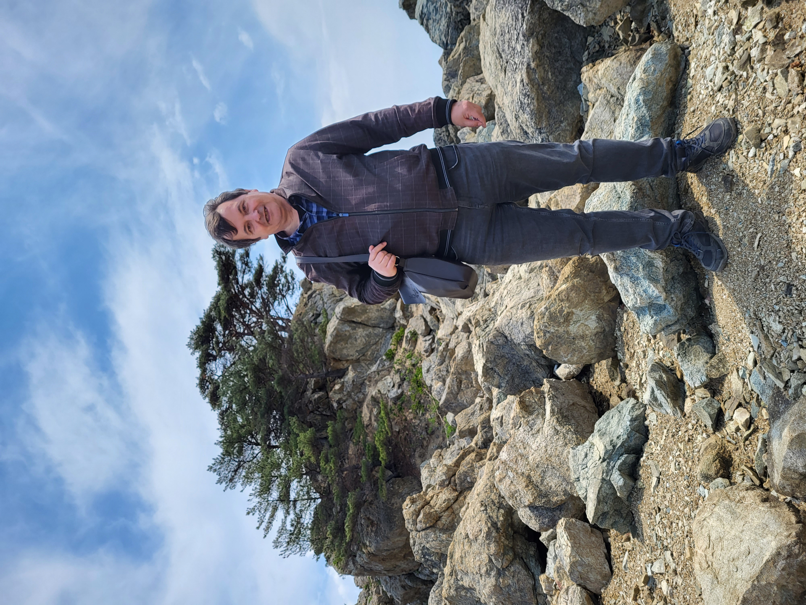
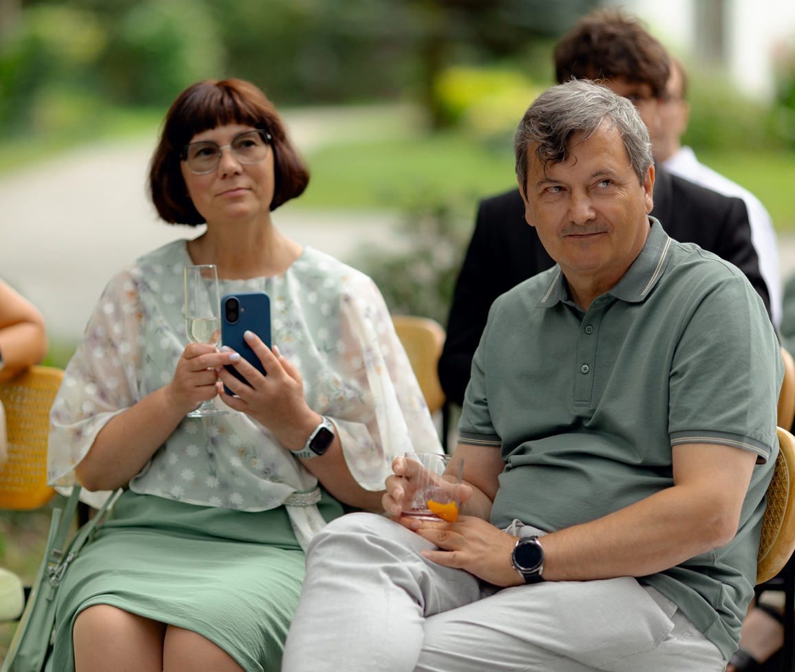
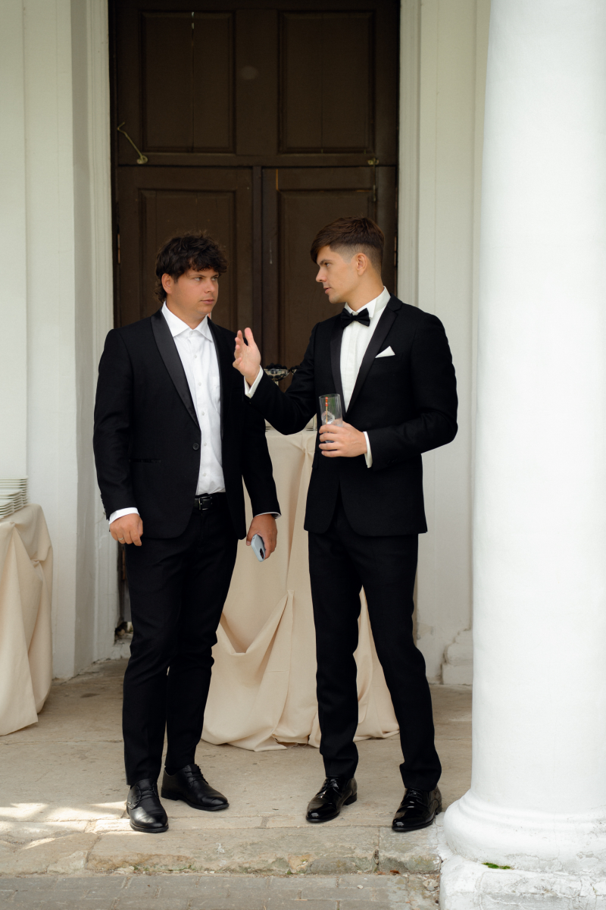
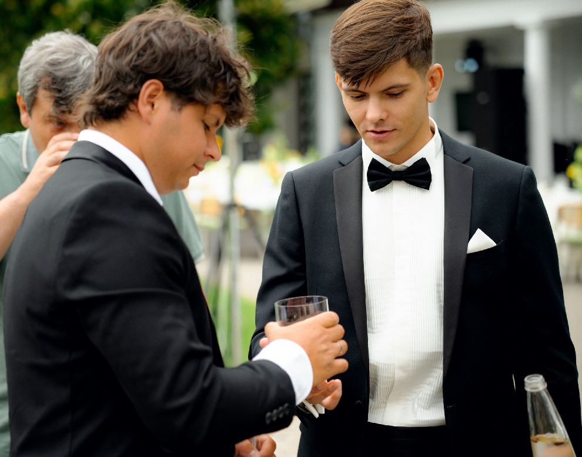
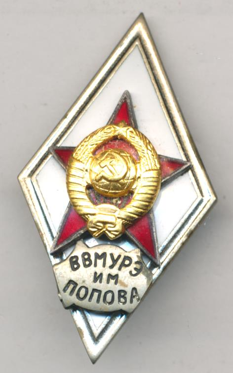
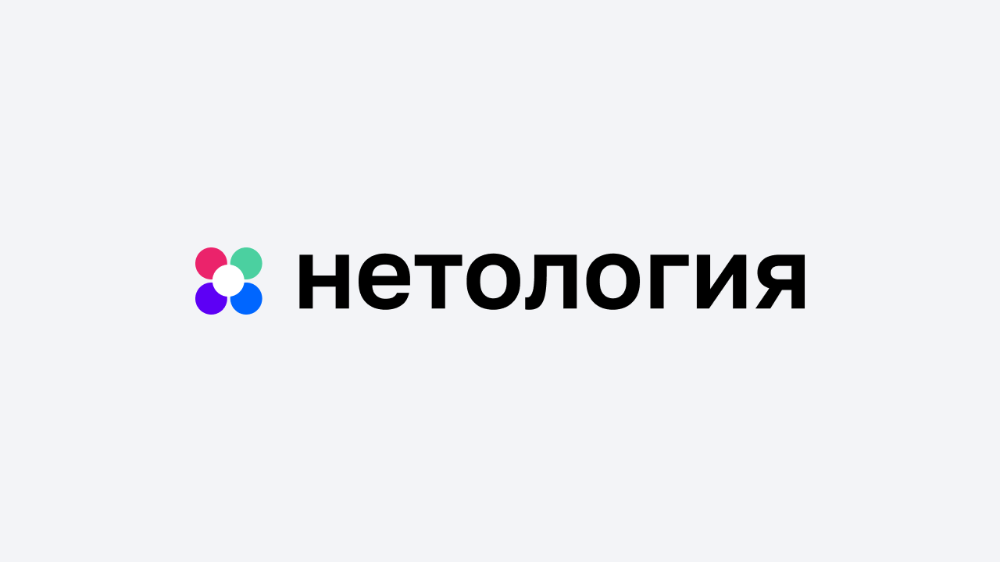
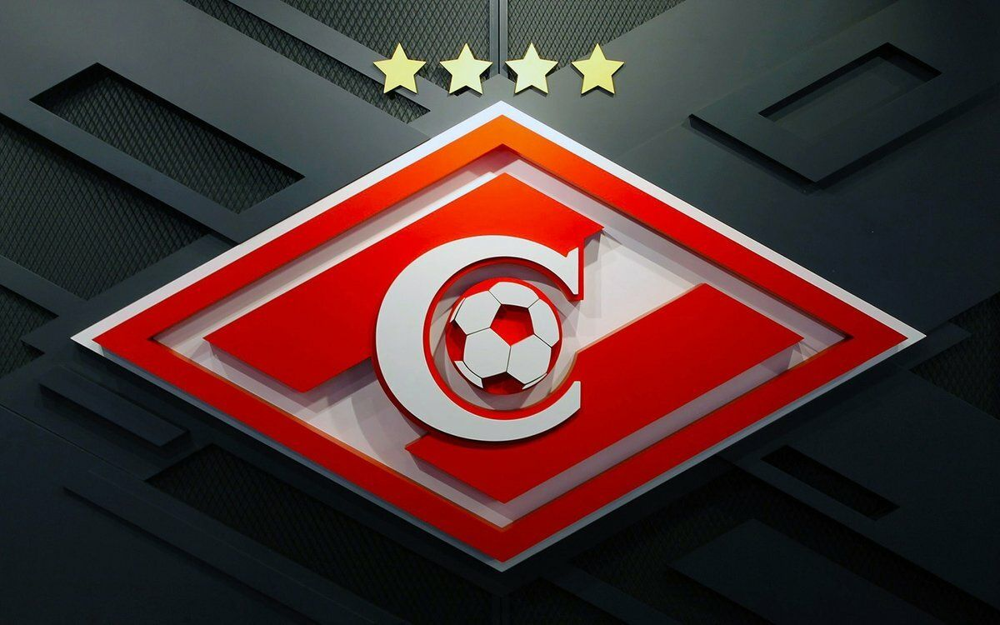

# Немного о себе

 

## Андрей Зуев, 58 лет
женат  

Двое сыновей

они тоже счастливы в браке

вот такая большая семья Зуевых

### Образование
1. ВВМУРЭ им Попова, по специальности "Математическое обеспечение АСУ" 
2. В настоящее время учусь в Нетологии по специальности "Тестировщик ПО"  Уже изучил модуль [Ручное тестирование веб-приложений](https://netology.ru/sharing/d9415450760440b14c9d711c0a60a243?utm_source=social&utm_campaign=certificate_lms )

### Опыт работы

Имею большой опыт работы в плане внедрения и системнго администрирования программного обеспечения. Но есть желание попробовать себя в разработке ПО.

### Увлечения
- кинематограф
- футбольный болельщик
